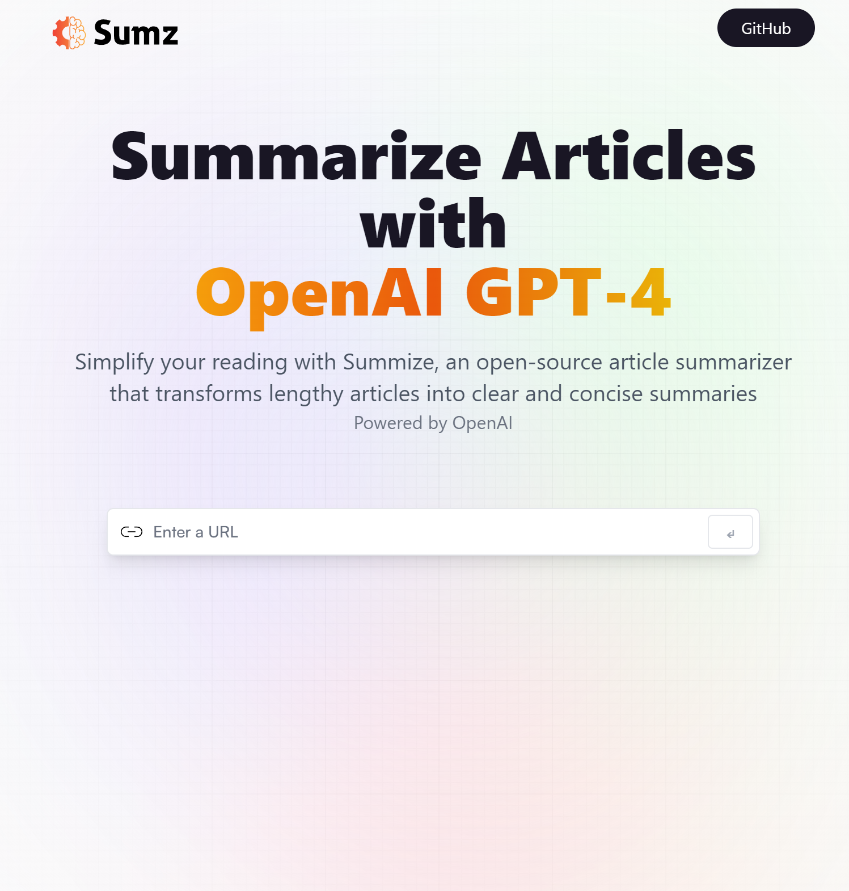

# [Summize - помощника в упрощении понимания веб-сайтов](https://articles-summary-rtk-tailwind-rapid.netlify.app/)

Создан на основе React, RTK Query и RapidApi

Добро пожаловать в проект Summize - вашего верного помощника в упрощении понимания веб-сайтов. Summize - это открытый проект для суммирования содержания веб-сайтов, который позволяет вкратце описать информацию и функционал сайта, даже если у вас есть только его адрес.

Преимущества Summize:
Упрощение анализа веб-сайтов: Summize позволяет пользователям быстро оценить содержание и функциональность веб-сайтов, даже без необходимости переходить по ссылкам.

Создание кратких описаний сайтов: Наш проект основан на передовых алгоритмах искусственного интеллекта, что обеспечивает создание точных и информативных резюме веб-сайтов.

Простота использования: Пользователи могут легко вводить адреса веб-сайтов для получения кратких описаний и быстрого понимания сути сайта.

Открытый исходный код: Summize является проектом с открытым исходным кодом, что позволяет разработчикам и исследователям вносить свой вклад и улучшать его функциональность.

Задачи проекта Summize:
Автоматическое суммирование содержания сайтов: Основной задачей Summize является создание высококачественных кратких описаний для различных веб-сайтов, облегчая понимание их сути.

Улучшение качества резюме: Продолжаем совершенствовать алгоритмы суммирования, чтобы обеспечить точность и полноту описаний веб-сайтов.

Интеграция и расширение: Я планируем интегрировать Summize в различные приложения и платформы, чтобы сделать его доступным для максимального числа пользователей.

    =============

# [Summize - an assistant in making websites easier to understand](https://articles-summary-rtk-tailwind-rapid.netlify.app/)

Built on React and RapidApi

Welcome to the Summize project - your trusty helper in making websites easier to understand. Summize is an open source project for summarizing website content, which allows you to summarize the information and functionality of a website, even if you only have its address.

Benefits of Summize: Simplify website analysis: Summize allows users to quickly evaluate the content and functionality of websites, even without clicking on links.

Creating website summaries: Our project is based on advanced artificial intelligence algorithms to create accurate and informative website summaries.

Ease of Use: Users can easily enter website addresses to get brief descriptions and quick insights.

Open Source: Summize is an open source project, allowing developers and researchers to contribute and improve its functionality.

Summize Project Objectives: Automatically Summarize Website Content: Summize's main objective is to create high quality summaries for different websites, making it easier to understand what they are about.

Improving the quality of summaries: We continue to improve our summarization algorithms to ensure the accuracy and completeness of website descriptions.

Integration and expansion: I plan to integrate Summize into various applications and platforms to make it accessible to the maximum number of users.

Community Involvement: I invite developers and researchers to join the project, improve it, and make Summize an even more powerful tool.
